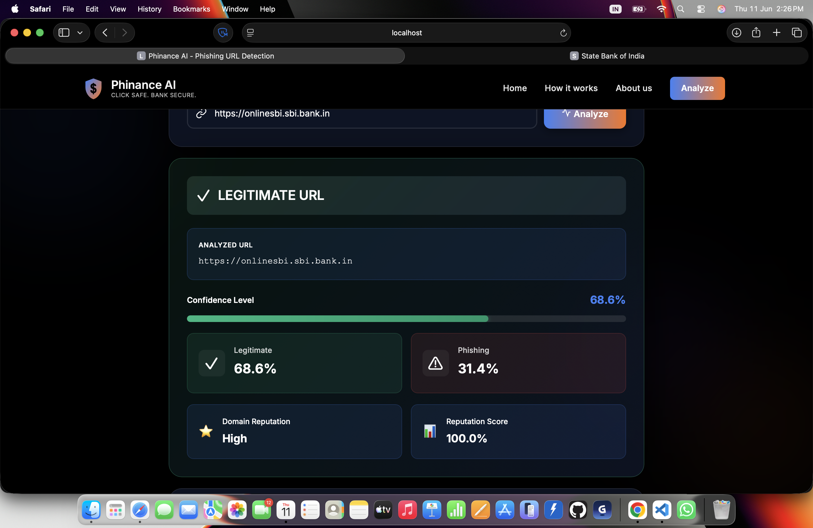
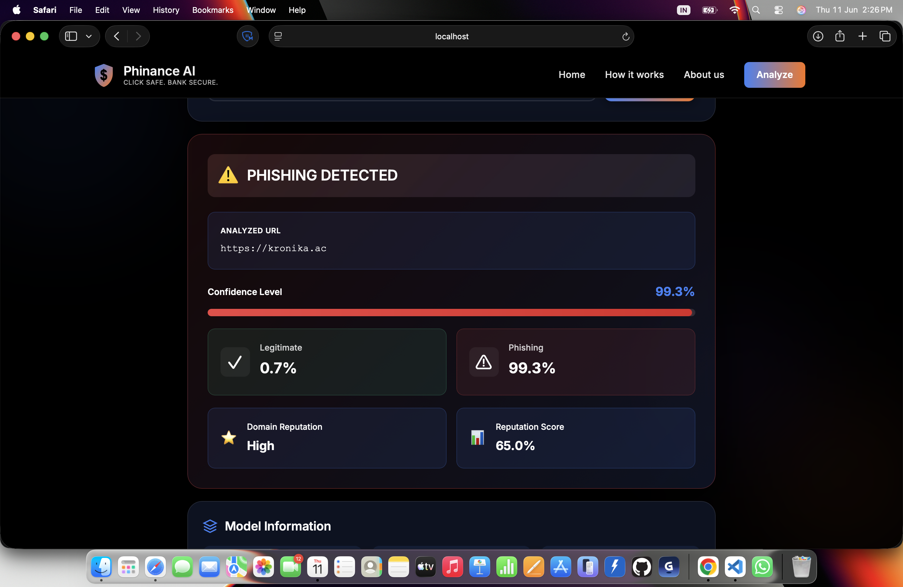

<div align="center">

# 🛡️ Phishing URL Detection System


### Machine Learning Powered Phishing & Spam URL Detection

Detect malicious URLs using a high-performance Gradient Boosting model trained on nearly half a million samples.


</div>

---

## 📌 Overview

Phishing attacks remain one of the most common cybersecurity threats. This project uses Machine Learning and URL-based feature engineering to identify phishing websites without requiring webpage content analysis.

The system analyzes URL structure, domain characteristics, entropy, special characters, subdomains, and other indicators to classify URLs as:

✅ Legitimate

🚨 Phishing

The model is trained on a combined dataset of **483,745 URLs** and achieves nearly **95% classification accuracy**.

---

## 🖼️ Application Screenshots

### Home Page


---

### URL Analysis Interface


---

### Legitimate URL Detection



---

### Phishing URL Detection



---

## 🚀 Features

- Real-time URL phishing detection
- Supports URLs, domains, and IP addresses
- Advanced URL feature extraction
- High-performance Gradient Boosting model
- Dockerized deployment
- CI/CD using GitHub Actions
- AWS EC2 deployment ready
- Lightweight inference
- No webpage scraping required

---

## 🏗️ Architecture

```text
User URL
    │
    ▼
Feature Extraction
(41 URL Features)
    │
    ▼
Gradient Boosting Model
    │
    ▼
Prediction Engine
    │
    ├── Legitimate
    └── Phishing
```

---

## ⚙️ DevOps & Deployment

This project follows modern DevOps practices.

### Tech Stack

| Category | Technology |
|-----------|------------|
| Machine Learning | Scikit-Learn |
| Backend | Python |
| Containerization | Docker |
| CI/CD | GitHub Actions |
| Cloud Hosting | AWS EC2 |
| Version Control | Git & GitHub |
| Model Serialization | Pickle |

### Deployment Pipeline

```text
Developer
    │
    ▼
GitHub Repository
    │
    ▼
GitHub Actions
(Testing + Build)
    │
    ▼
Docker Image
    │
    ▼
AWS EC2 Deployment
    │
    ▼
Production Environment
```

---

## 📊 Model Performance

### Best Model

**Gradient Boosting Classifier**

| Metric | Score |
|----------|----------|
| Accuracy | 94.97% |
| ROC-AUC | 97.73% |
| Precision | 97.20% |
| Recall | 91.60% |
| F1 Score | 94.32% |

### Classification Report

| Class | Precision | Recall | F1 |
|---------|---------|---------|---------|
| Legitimate | 0.93 | 0.98 | 0.95 |
| Phishing | 0.97 | 0.92 | 0.94 |

---

## 📈 Dataset Information

### Dataset 1

**Mendeley Phishing URL Dataset**

- 247,950 Samples
- 41 URL-based Features

### Dataset 2

**UCI PhiUSIIL Phishing URL Dataset**

- 235,795 Samples
- URL Characteristics

### Combined Dataset

| Metric | Value |
|---------|---------|
| Total Samples | 483,745 |
| Training Samples | 386,996 |
| Test Samples | 96,749 |
| Features | 41 |

---

## 🔍 Top Features

The most influential features identified by the model:

1. URL Length
2. Number of Digits
3. Domain Length
4. Average Subdomain Length
5. Number of Subdomains
6. Special Character Count
7. Domain Entropy
8. Slash Count
9. URL Entropy
10. Path Length

---

## 🐳 Running with Docker

Build image:

```bash
docker build -t phishing-detector .
```

Run container:

```bash
docker run -p 5000:5000 phishing-detector
```

---

## 💻 Local Installation

Clone repository:

```bash
git clone https://github.com/yourusername/phishing-url-detection.git
```

Move into project:

```bash
cd phishing-url-detection
```

Install dependencies:

```bash
pip install -r requirements.txt
```

Train model:

```bash
python train_model.py
```

Run prediction:

```bash
python predict_phishing.py https://example.com
```

---

## 📂 Project Structure

```text
Phishing-URL-Detection
│
├── screenshots/
│   ├── banner.png
│   ├── home.png
│   ├── analyze.png
│   ├── legitimate.png
│   └── phishing.png
│
├── models/
│   ├── phishing_detection_model.pkl
│   └── model_features.pkl
│
├── train_model.py
├── predict_phishing.py
├── requirements.txt
├── model_info.json
└── README.md
```

---

## 🎯 Future Improvements

- Deep Learning models
- Explainable AI (SHAP)
- Browser Extension
- REST API Deployment
- Kubernetes Deployment
- Threat Intelligence Integration
- Real-time Monitoring Dashboard

---

## 👨‍💻 Author

**Dhruv Maheshwari**

B.Tech AWS Student | Cloud Computing | DevOps | Machine Learning | Full Stack Development

GitHub: https://github.com/dhxruv999

---

## ⭐ Support

If you found this project useful, consider giving it a star ⭐ on GitHub.
